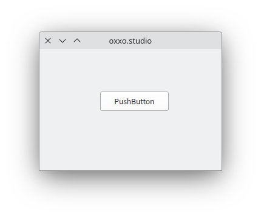

# PyQt5 專案指引

## 專案摘要

專案目標：

1.  製作 PyQt5 專案之模版；
2.  驗證 AlanJui/nvimX 專案 Neovim 設定檔之可用性。

## [nvimX 引用 LSP 之設計架構](https://github.com/AlanJui/nvimX)

Language Server 要能正常運作，需經：（1）安裝；（2）設定，共兩個步驟。目前 nvimX 的架構設計為：

1.  LSP Servers / DAPs / Linters / Formatters 各執行檔之安裝，交由 mason 插件的 MasonInstallAll 指令完成安裝作作。
    請參考： `~/.config/nvim/lua/plugins/lsp/mason.lua`

2.  至於各 LSP Servers 之設定，則使用 nvim-lspconfig 插件完成 LSP Servers 設定作業。
    請參考： `~/.config/nvim/lua/plugins/lsp/lsp-config.lua`

## 常用操作指令

### 查詢專案使用之 Python 版本

```sh
pyenv version
```

### 安裝專案使用之 Python 版本

1. 查詢作業系統已安裝之各個 Python 版本

```sh
pyenv versions
```

2. 比對專案使用 Python 版本之結果，若作業系統已安裝，可略過以下工作；但要是尚未安裝，則使用以下指令完成安裝。

```sh
pyenv install <Version_No>
```

【舉例】：

```sh
[alanjui@Dell-7050m-EndeavourOS PyQt5]$ pyenv version
3.12.1 (set by /home/alanjui/workspace/python/PyQt5/.python-version)

[alanjui@Dell-7050m-EndeavourOS PyQt5]$ pyenv versions
  system
* 3.10.6

[alanjui@Dell-7050m-EndeavourOS PyQt5]$ pyenv install 3.12.1
```

3. 驗證安裝結果：執行 python 直譯器軟件，若能正常啟動，且其版本編號同專案使用之 Python 版本，則表安裝正常完成。

```sh
[alanjui@Dell-7050m-EndeavourOS PyQt5]$ python
Python 3.12.1 (main, Jan 22 2024, 16:12:47) [GCC 13.2.1 20230801] on linux
Type "help", "copyright", "credits" or "license" for more information.
>>>
```

【註】：結束 Python 直譯器，可用 <Ctrl-D> 退出。

### 建置專案使用之虛擬環境

```sh
python -m venv .venv
source .venv/bin/activate
```

### 安裝專案使用之 Python 套件

```sh
pip install -r requirements.txt
```

【註】： 製作專案 Python 套件清單方法

```sh
rm requirements.txt
pip freeze > requirements.txt
```

### 驗證專案開發平台已完成安裝作業

透過 python 直譯器，執行程式碼 pg001.py ，若安裝作業正確，應可見執行結果畫面如下所示。

```sh
python pg001.py
```

執行結果畫面：



## Python Linter 操作指引

正常情況，Neovim 與 Python LSP Server / Linters 插件整合，程式碼檢查（Linting）作業之
結果，可於 Neovim 編輯器中瀏覽。若有異常狀況發生，可先退出 Neovim ，直接於終端機執行
linter 指令。若 linter 能正常作業，則表應是 Neovim 之 LSP Server 或 Linters ，其設定
有錯。

### 使用指令執行 pylint

```sh
pylint <source_code>
```

【實例】：

```sh
pylint pg001.py
```

或

```sh
pylint --rcfile=<pylint_configuration> <source_code>
```

【實例】：

```sh
pylint --rcfile=./pyproject.toml pg001.py
```

## Linter 設定檔

### pylint

pylint 之設定檔，檔名可以是以下任何一種：

1.  pylintrc
2.  .pylintrc
3.  pylint.json
4.  pyproject.toml

### mypy

1.  ./mypy.ini
2.  ./.mypy.ini
3.  ./pyproject.toml
4.  ./setup.cfg
5.  $XDG_CONFIG_HOME/mypy/config
6.  ~/.config/mypy/config
7.  ~/.mypy.ini
